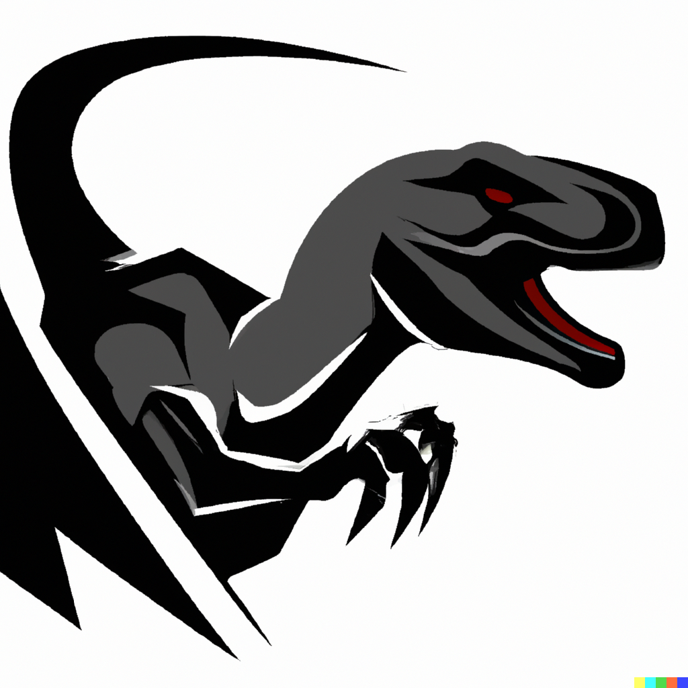

# Disraptor
High-performance data structure inspired by LMAX Disruptor, optimized for performance. 

## Why the name? 
The name pays tribute to the renowned LMAX Disruptor, which serves as the foundational inspiration for our project.
Additionally, 'Raptor' is derived from the Velociraptor, meaning 'fast thief' — reflecting our data structure's fast performance. 
But raptors are not only fast but the legend also says they hunt in packs, representing the main principle behind this data structure: batching.
Every consumer/producer tries to take batches out of the data structure, this allows to exploit little law and allow stragglers to catch up.

## TODOs 
- [ ] rename ringbus
- [ ] rename consumer in observer  (observes the stream) 
- [ ] fuzzing 
- [ ] more tests
- [ ] clean up interface
- [ ] benchmark various topologies 
   - [ ] chain 
   - [ ] diamond 
   - [ ] multi producer/ consumer
- [ ] benchmark scalability

